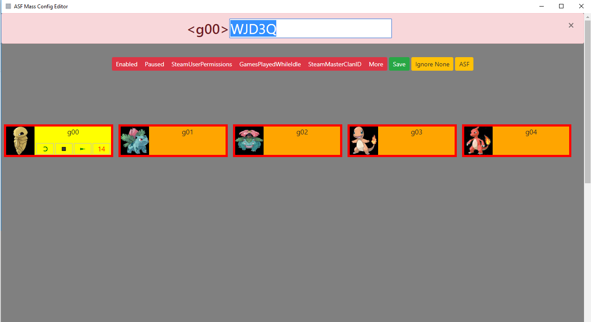

ASF MCE (Mass Config Editor) is tool to edit multiple value in multiple json files (for https://github.com/JustArchi/ArchiSteamFarm) simply and fast.
Also it alows you to send IPC commands and shows 2fa codes.
You can select values which you want to change and you can also select bots (json files) which you want to change or ignore.

How to use this app:

button "Local Bots Config" toggles buttons to edit local bot config files
You can select values which you want to change ( Enabled, Paused, SteamUserPermissions, GamesPlayedWhileIdlem, SteamMasterClanID, More); only selected (green) values will be changed in your config (bot.json) files. Save button will save changes to config files. Simple values if true is clicked (green) it will be set to true if not (red) it will be set to false. Other text or number values show the examples for input. In More field you can add any other settings (key:value) stored in valid json code like this: {"HandleOfflineMessages":false,"DismissInventoryNotifications":true,"AutoDiscoveryQueue":true} and this keys and values will be added /or updated to selected bots.

button "Selection" toogles buttons for bot selection: Ignore None / Ignore All, One by One / Range, Range is used in IPC commands;

button "IPC" show IPC toggles inputs: command bots other_arguments

button "Log" toggles Log

You can select accounts which you DON'T WANT to edit by clicking on the name of bot (gray background - will be IGNORED) and account with green background will be SELECTED.  

Also you can see if loaded bots are Enabled, Paused or none of those (in bot.json file) by the color of the bots BORDER (orange:Enabled=false; cadetblue:Enabled=true,Paused=true; green:Enabled=true,Paused=false; aqua:Online)

To get 2fa code (you must have imported: https://github.com/JustArchi/ArchiSteamFarm/wiki/Escrow#import ) double click on bot name and code should be copied to clipboard (also it is shown at the top for 10 sec).

When you hover over bot you can see buttons:
1. Will open new window in chrome as App with current bot profile on steam and all cache data, session, cookies and passwords will be stored in  "./\_bot_browser_data/botname" so if you log in use name and pass for CLICKED ACCOUNT. If you CTRL+ click it will open new window in nwjs also with data stored in "./\_bot_browser_data/botname".

2. Will send IPC command to start this bot.

3. Will send IPC command to stop this bot.

4. Not implemented yet!

REMEMBER TO BACKUP YOUR CONFIG FOLDER TO SAVE LOCATION!

To start ASF MCE execute ASF_MCE.cmd

To install ASF MCE you can:

git clone https://github.com/genesix-eu/ASF_MCE

cd ASF_MCE

npm i

copy ASF folder where ASF MCE is

File structure should be like this:
ASF_MCE/ASF/config/bot01.json
ASF_MCE/ASF/ArchiSteamFarm.exe
ASF_MCE/css/*.*
ASF_MCE/img/*.*
ASF_MCE/js/*.*
ASF_MCE/node_modules/*.*
ASF_MCE/index.html
ASF_MCE/package.json
ASF_MCE/*.*

Or download it from here: https://nwjs.huuuuu

And this my first atempt to use git and github so Keep Calm and Git Gud!