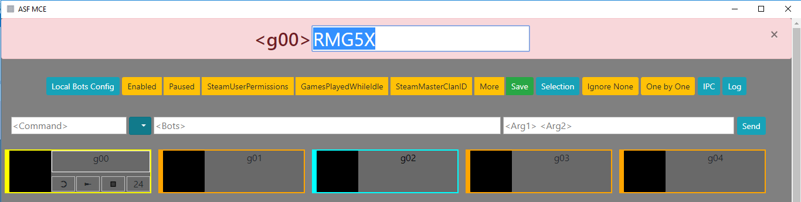

# ASF MCE

ASF MCE (Mass Config Editor) is a tool to edit multiple properties in multiple JSON files of [ArchiSteamFarm](https://github.com/JustArchiNET/ArchiSteamFarm/) simply and quickly.

It also allows you to send IPC commands and shows 2FA codes.

## Installation

You can download pre-installed package or install from source code.

### Download release

[Download latest release](https://github.com/genesix-eu/ASF_MCE/releases/) and copy the ASF folder into ASF MCE folder.

### Install from source code

```shell
git clone https://github.com/genesix-eu/ASF_MCE
cd ASF_MCE
npm i
```

Then copy the ASF folder into ASF MCE folder.

The final folder structure should be like:

```
ASF_MCE/
├─ ASF/
│    ├─ config/
│    │    ├─ bot_01.json
│    │    └─ ...
│    ├─ ArchiSteamFarm.exe
│    └─ ...
├─ css/
├─ img/
├─ js/
├─ node_modules/
├─ index.html
└─ ...
```

## Usage

Double click `ASF_MCE.cmd` to start ASF MCE.



### Config editing

* **"Local Bots Config" button**: toggle properties editing buttons. You can select properties which you want to change (Enabled, Paused, SteamUserPermissions, GamesPlayedWhileIdle, SteamMasterClanID, More); only selected (green) properties will be changed in your config files.
* **"Save" button**: save changes to config files.

**Remember to backup your config files before editing!**

### Properties

* **Boolean properties**: if it's clicked (green) it will be true, otherwise (red) it will be false.
* **String or number properties**: an input dialog will popup.
* **"More" button**: you can add any other key-value properties in valid JSON structure like this:

```json
{"OnlineStatus": 1, "IdleRefundableGames": false, "AutoSteamSaleEvent": true}
```

### Bot selection

* **"Selection" button**: toggle bot selection buttons, include `Ignore None / Ignore All`, `One by One / Range`. The range selection will be used in IPC commands.
* **Click bot name**: toggle given bot selection (selected / ignored).

Ignored bots' config files won't be edited.

### Bot cards

Card background:

* **Green**: bot is selected.
* **Gray**: bot is ignored.

Card border:

* **Orange**: bot is disabled.
* **Cadetblue**: bot is enabled and paused.
* **Green**: bot is enabled.
* **Aqua**: bot is online.

Controls:

* **Double click bot name**: Copy 2FA code of given bot, you must have imported [ASF 2FA](https://github.com/JustArchiNET/ArchiSteamFarm/wiki/Two-factor-authentication). The code will be copied to clipboard and show up 10 seconds.
* **Button 1**: will open a new window in chrome as an app with given bot's steam profile. All cached data, session, cookies and passwords will be stored in `"./_data_bots/<botname>"`. If you press Ctrl when click, the nwjs window will be opened instead of Chrome.
* **Button 2**: start given bot by IPC command.
* **Button 3**: stop given bot by IPC command.
* **Button 4**: not implement yet.

### Others

* **"IPC" button**: toggle IPC command UI.
* **"Log" button**: toggle log.

## Note

This is my first attempt to use git and GitHub, so Keep Calm and Git Gud!